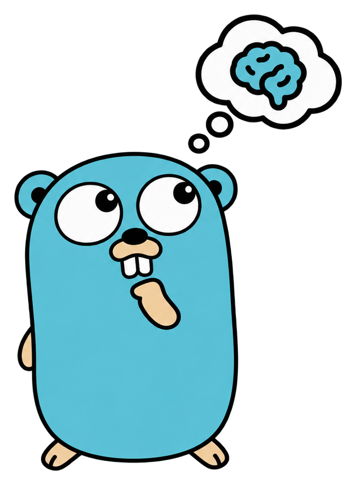

<div align="center">



# mempher

**Long-term memory for AI agents, in Go.**


[](https://github.com/mempher/mempher/actions/workflows/ci.yml)
[](https://codecov.io/gh/mempher/mempher)
[](https://pkg.go.dev/github.com/mempher/mempher)
[](https://securityscorecards.dev/viewer/?uri=github.com/mempher/mempher)

[](https://github.com/mempher/mempher/releases)
[](LICENSE)

</div>

---

One database and one binary. No graph store, no vector service, no Python
sidecar, and no model client. `Embedder` is an interface you satisfy with
whatever you already use.

## The invariant

Memory is layered, and the layers are not peers.

**Episodes (L0) are immutable and the only source of truth.** Everything else is
a projection derived from them: vector encodings today, extracted facts and their
validity windows next. A projection can be dropped and rebuilt at any time by
replaying L0 through the same deriving code.

Two rules follow, and the schema enforces both. A trigger on `episodes` rejects
`UPDATE`, `DELETE` and `TRUNCATE`:

- an episode is never updated and never deleted;
- a projection is only ever written by a worker draining the job queue.

That is what makes a bad extractor recoverable and forgetting safe.

## Three loops

| Loop | When | Model calls | Does |
| --- | --- | --- | --- |
| **Write** | hot path, one round trip | none | insert one episode, capture its binding, enqueue the work it implies |
| **Consolidate** | offline, batched, replayable | all of them | drain the queue; idempotent, so retries are free |
| **Read** | synchronous | one, to embed the query | parallel channels → reciprocal rank fusion → validity filter → token budget → results with provenance |

## Usage

```go
pool, err := pgxpool.New(ctx, os.Getenv("DATABASE_URL"))

// Embedded, forward-only, and safe to call from every instance at startup.
_, err = postgres.Migrate(ctx, pool, postgres.MigrateOptions{
	VectorDimensions: myEmbedder.Dimensions(),
})

store, err := postgres.New(ctx, pool) // satisfies both mempher.Store and mempher.Queue

mem, err := mempher.New(mempher.Config{Store: store, Embedder: myEmbedder})

// Write: no model call, one round trip.
_, err = mem.Append(ctx, mempher.AppendRequest{
	Scope:   "user:8123",
	Content: "I'm allergic to hazelnuts.",
	Role:    mempher.RoleUser,
	Source:  "cli",
	Binding: mempher.Binding{"session": "s-42"},
})

// Read: fused, filtered, budgeted, with provenance on every hit.
rec, err := mem.Recall(ctx, mempher.RecallRequest{
	Scope:     "user:8123",
	Query:     "any food allergies?",
	Limit:     5,
	MaxTokens: 2000,
})
for _, r := range rec.Episodes {
	fmt.Printf("%.4f  %s  %v\n", r.Score, r.Episode.Content, r.Hits)
}
```

Encoding happens off the write path, so run a worker:

```go
w, err := mempher.NewWorker(mempher.WorkerConfig{Store: store, Embedder: myEmbedder})
go w.Run(ctx) // or w.DrainOnce(ctx) for a one-shot, and in tests
```

An episode is durable and **lexically** searchable the moment `Append` returns,
because the `tsvector` is a generated column. It becomes **semantically** searchable once
a worker encodes it. Recall fuses whichever channels answered and reports what
each contributed, so a thin result is never mistaken for an empty memory.

## Requirements

- Go 1.27
- PostgreSQL 18 or newer: `uuidv7()` and `uuid_extract_timestamp()` are used
  directly, and the migration refuses to run on anything older
- the `vector` (pgvector) and `btree_gin` extensions, in any schema; `Migrate`
  creates them if the role is permitted to

Everything lives in one schema, `mempher`, so it installs alongside an existing
application schema and uninstalls by dropping one schema.

## Testing

```sh
make test      # fast suite, no Docker: DB tests guard on testing.Short()
make test-all  # everything, with -race, against a real PostgreSQL 18 container
make check     # what CI runs
```

Determinism comes from injecting a `Clock` and a fake `Embedder`, never from
mocking the database: retrieval depends on pgvector's distance ordering and
PostgreSQL's text search ranking, which a mock would reimplement wrongly.

## License

Apache-2.0. See [LICENSE](LICENSE).
