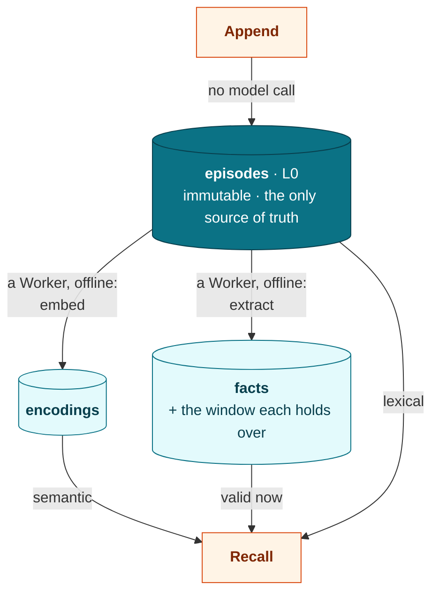
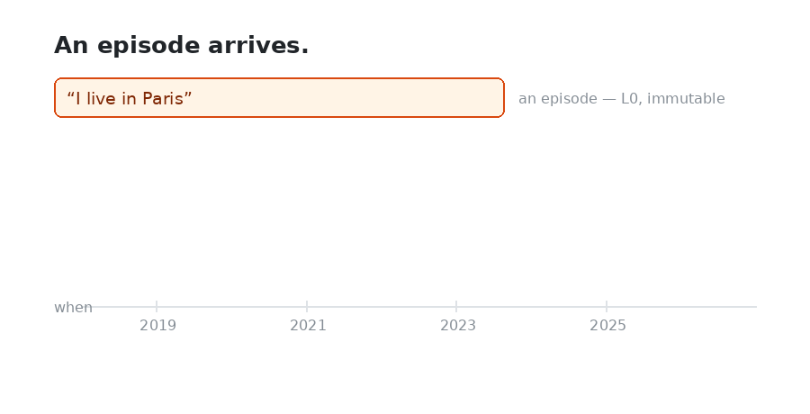

<div align="center">


# mempher

**Long-term memory for AI agents, in Go.**


[](https://github.com/mempher/mempher/actions/workflows/ci.yml)
[](https://codecov.io/gh/mempher/mempher)
[](https://pkg.go.dev/github.com/mempher/mempher)
[](https://securityscorecards.dev/viewer/?uri=github.com/mempher/mempher)

[](https://github.com/mempher/mempher/releases)
[](LICENSE)

</div>

---

## The idea

**Your agent's memory is an append-only log. Everything else — the vectors, the
facts — is a projection you can delete and rebuild by replaying it.**

That is the whole design, and everything good about mempher falls out of it.
Change your embedding model, fix a bad extraction prompt, or honour an erasure
request: nothing is lost that the log did not lose. A projection is never
precious, because it can always be derived again.

**And a fact that stops being true has its window closed, not its row
overwritten.** "Where do they live?" and "where did they live last year?" are
different questions, and both still have an answer.



One PostgreSQL database and your binary. No graph store, no vector service, no
Python sidecar, and no model client you did not choose — `Embedder` and
`Extractor` are two small interfaces, and both halves ship working.

## Why it is built this way

Most memory for agents mutates what it knows: a store of facts or summaries that
get rewritten as the world changes. That is simpler until the day something goes
wrong, and then there is nothing to go back to.

| | The common approach | mempher |
| --- | --- | --- |
| **When a fact changes** | the row is updated in place | the old window is closed; both answers survive |
| **When your extraction prompt was wrong** | the bad output is the state | drop the projection, replay the log |
| **When you change embedding model** | re-ingest, or migrate vectors | it's a backfill; the log never moved |
| **When someone asks to be erased** | delete rows and hope nothing derived survived | one transaction, counted, with everything derived from them |
| **Where "what was true last year" lives** | usually nowhere | in the fact's validity window |
| **What you have to run** | a vector DB, often a graph DB, often a sidecar | PostgreSQL |

The trade-off is real and worth stating: you need PostgreSQL 18, you do your own
embedding calls, and a projection is only as current as your worker. What you get
back is a memory you can always rebuild, and a straight answer to "why does it
think that?" — every fact carries the episodes it was read from.

## Try it

One container and one command:

```sh
docker run --rm -p 5432:5432 -e POSTGRES_PASSWORD=mempher pgvector/pgvector:pg18
go run ./examples/quickstart
```

No API key: the example uses a deterministic hashed-bag-of-words embedder and a
few substring rules in place of a model, so it runs anywhere. They are exactly
the two interfaces you replace with a real provider, and nothing else in that
file changes when you do.

```
appended 3 episodes -- already searchable lexically
worker drained 6 jobs -- now searchable semantically, and facts exist

query: "allergic to hazelnuts"
  fact     the user is allergic to hazelnuts  [since 2019-05-10, still true]
  fact     the user lives in Paris  [since 2019-04-01, still true]
  episode  0.0328  "I'm allergic to hazelnuts, so no Nutella."  via lexical+semantic
  episode  0.0161  "I moved to Paris last spring."  via semantic

---- after moving to Berlin ----
query: "moved to Berlin"
  fact     the user lives in Berlin  [since 2024-06-01, still true]

---- and where did they live in 2020? ----
  fact  the user lives in Paris  [2019-04-01 to 2024-06-01]

erased: 4 episodes, 4 encodings, 3 facts, 8 jobs (scope removed: true)
```

That last pair is the point. Berlin is the answer now; Paris is still the answer
for 2020, bounded by exactly when it stopped being true.

## Three loops

| Loop | When | Model calls | Does |
| --- | --- | --- | --- |
| **Write** | hot path, one round trip | none | insert one episode, capture its binding, enqueue the work it implies |
| **Consolidate** | offline, batched, replayable | all of them | drain the queue: embed episodes, extract facts; idempotent, so retries are free |
| **Read** | synchronous | one, to embed the query | parallel channels → reciprocal rank fusion over episodes, validity filter over facts → token budget → results with provenance |

## Usage

```go
pool, err := pgxpool.New(ctx, os.Getenv("DATABASE_URL"))

// Embedded, forward-only, and safe to call from every instance at startup.
_, err = postgres.Migrate(ctx, pool, postgres.MigrateOptions{
	VectorDimensions: myEmbedder.Dimensions(),
})

store, err := postgres.New(ctx, pool) // satisfies every port, off one pool

// Extractor is optional. Leave it nil and L1 is off: no extract jobs, no facts.
mem, err := mempher.New(mempher.Config{
	Store:     store,
	Embedder:  myEmbedder,
	Extractor: myExtractor,
})

// Write: no model call, one round trip.
_, err = mem.Append(ctx, mempher.AppendRequest{
	Scope:   "user:8123",
	Content: "I'm allergic to hazelnuts.",
	Role:    mempher.RoleUser,
	Source:  "cli",
	Binding: mempher.Binding{"session": "s-42"},
})

// A turn that produced several episodes goes in one round trip -- and becomes
// one encode job, so the worker embeds the whole turn in one model call.
_, err = mem.AppendBatch(ctx, []mempher.AppendRequest{question, toolCall, answer})

// Read: fused, filtered, budgeted, with provenance on every hit.
rec, err := mem.Recall(ctx, mempher.RecallRequest{
	Scope:     "user:8123",
	Query:     "any food allergies?",
	Limit:     5,
	MaxTokens: 2000,
})
for _, f := range rec.Facts {
	fmt.Printf("%s  (since %s)  %v\n", f.Fact.Statement, f.Fact.Valid.From, f.Fact.Episodes)
}
for _, r := range rec.Episodes {
	fmt.Printf("%.4f  %s  %v\n", r.Score, r.Episode.Content, r.Hits)
}
```

Consolidation happens off the write path, so run a worker:

```go
w, err := mempher.NewWorker(mempher.WorkerConfig{
	Store: store, Embedder: myEmbedder, Extractor: myExtractor,
})
go w.Run(ctx) // or w.DrainOnce(ctx) for a one-shot, and in tests
```

An episode is durable and **lexically** searchable the moment `Append` returns,
because the `tsvector` is a generated column. It becomes **semantically**
searchable once a worker encodes it, and has yielded whatever **facts** it holds
once a worker extracts it. Recall fuses whichever channels answered and reports
what each contributed, so a thin result is never mistaken for an empty memory.

## Where the models plug in

Two ports, and they cost very different amounts of work.

`Embedder` is the easy one, and
[`mempher/embed/openai`](https://pkg.go.dev/github.com/mempher/mempher/embed/openai)
covers it against any OpenAI-compatible embeddings endpoint — which is most of
them, local servers included.

```go
embedder, err := openai.New(openai.Config{
	Model:      "text-embedding-3-small",
	Dimensions: 1536,
})

// Asymmetric models — bge, e5 — want an instruction on the query side only.
// It is part of the model id, because it changes where queries land.
embedder, err := openai.New(openai.Config{
	Model: "bge-small-en-v1.5", Dimensions: 384,
	BaseURL:     "http://localhost:8080/v1",
	QueryPrefix: "Represent this sentence for searching relevant passages: ",
})
```

The width is declared rather than discovered, because the schema is migrated for
it, and every reply is checked against it — a model swapped for one of another
size is caught at the call rather than at a constraint three statements later.

`Extractor` is the hard one, and
[`mempher/extract`](https://pkg.go.dev/github.com/mempher/mempher/extract) ships
it working. It owns the prompt, the response schema and the validation that
decides what a `FactStore` will accept — the part that is a prompt rather than a
schema, and the part most likely to be wrong.

```go
// Both adapters speak the provider's REST API directly. No SDK, and nothing
// new in your go.mod: still pgx and uuid.
completer, err := anthropic.New(anthropic.Config{Model: "claude-opus-5"})

// openai.New is the same shape, and BaseURL points it at anything
// OpenAI-compatible: Azure, Groq, Together, OpenRouter, Ollama, vLLM.
completer, err := openai.New(openai.Config{Model: "gpt-5"})

ex, err := extract.New(completer, extract.Options{
	// The most valuable option here. A triple is identity, so a model that
	// writes "lives_in" today and "resides_in" tomorrow supersedes nothing,
	// ever. The vocabulary goes into the schema as an enum, so the provider
	// enforces it rather than the parser catching it afterwards.
	Predicates:   []mempher.Predicate{"lives_in", "allergic_to", "works_at"},
	Instructions: "A support agent: care about entitlements and past incidents.",
})

fmt.Println(ex.Model()) // mempher-extract/v1+claude-opus-5+a3f9c1e2
```

Any other provider is one method — `Complete(ctx, extract.Prompt) ([]byte, error)`
plus `Model() string`. The adapter hands the prompt over and returns the bytes;
reading the answer is the package's job.

That id is the point of the package. It composes the shipped prompt revision,
your model, and a digest of the options -- so editing the instructions makes a
*different* extractor, and its facts are a backfill rather than a silent mixture
with the old ones. The same contract as changing embedding model.

The honest limit: an extraction can only retract facts it was handed, and how
many it is handed is `WorkerConfig.KnownFactLimit`. Extraction is a pure function
of its inputs -- an extractor that went looking in the store could not be
replayed, and replay is the only repair L1 has. `Options.Reconcile` spends a
cheap first call to pick the relevant ones out of that set; nothing can enlarge
it.

## The invariant, and what enforces it

**Episodes (L0) are immutable and the only source of truth.** A trigger on
`episodes` rejects `UPDATE` and `TRUNCATE` outright, and rejects `DELETE` unless
the transaction has declared that it is erasing:

- an episode is never updated — a row that exists is exactly what was recorded;
- a projection is only ever written by a worker draining the job queue.

That is what makes a bad extractor recoverable, and what makes erasure something
you can point at rather than a `DELETE` anyone can write.

## Two layers, not two rankings

L0 is what was said. L1 is what is true. Recall returns both and does not rank
them against each other: episodes are fused by relevance to the query, while
facts are simply what the scope currently believes, spent from the token budget
first. A fact carries the window it holds over, so the answer to "where do they
live?" and the answer to "where did they live last year?" are both still there.

Nothing is ever deleted to make that work. A claim the world has moved past has
its window closed, and stays answerable.

<div align="center">

</div>

## Forgetting means two things

Closing a window is not deleting. When someone asks to be *erased*, that is
`Forget` — the one operation here that destroys anything:

```go
// A whole scope, or name Episodes to take only some of them.
res, err := mem.Forget(ctx, mempher.ForgetRequest{Scope: "user:8123"})
```

One transaction takes the episodes, their vectors, their extraction markers,
their queued jobs, and every fact whose provenance names them. A fact is deleted
rather than closed, because a closed window still says what it said — and that is
safe for the reason every projection is safe: if what remains still supports the
claim, the next extraction re-derives it.

## Operating it

Everything you need to run mempher in production, and nothing you need to use it,
lives in [`mempher/ops`](https://pkg.go.dev/github.com/mempher/mempher/ops):

```go
o, err := ops.New(ops.Config{Store: store, Embedder: myEmbedder})

// The work L0 implies but the queue has lost: a job that died, a scope that
// predates your Extractor, a model id that changed last week.
res, err := o.Backfill(ctx, ops.BackfillRequest{})

// And the queue as something to read, not just to drain.
dead, err := o.Jobs(ctx, ops.JobQuery{States: []mempher.JobState{mempher.JobStateDead}})
depth, err := o.Stats(ctx, "")          // per kind and state, with the oldest job's age
_, err = o.Retry(ctx, dead[0].ID)       // once you have dealt with the cause
_, err = o.Purge(ctx, ops.PurgeRequest{Before: lastMonth})
```

`Backfill` asks L0 what work it implies and enqueues whatever is missing, reading
the projection tables rather than the queue's own history. It is safe to run
live, safe to run twice, and resumable — which is what makes "drop the projection
and replay" a real repair rather than a slogan.

## How fast

Against PostgreSQL 18 in a container on a developer laptop, over a scope of 1,000
episodes, with a microsecond-cost embedder so the numbers are mempher's own:

| | per operation | per episode |
| --- | --- | --- |
| `Append` | **~0.45 ms** — one round trip, no model call | 0.45 ms |
| `AppendBatch`, 8 | 1.2 ms | 0.16 ms |
| `AppendBatch`, 32 | 2.2 ms | 0.07 ms |
| `AppendBatch`, 64 | 3.3 ms | **0.05 ms** |
| `Recall`, all channels | **4.1 ms** | |
| `Recall`, semantic only | 2.5 ms | |
| `Recall`, lexical only | 1.1 ms | |
| `Recall`, with L1 facts | 4.3 ms | |

A single durable append is mostly one WAL fsync, so it has a floor that no amount
of Go will move. Batching is what goes under it: one round trip and one commit
shared by the whole batch takes an episode from 0.45 ms to 0.05 ms, nine times
cheaper — and the saving compounds, because the batch is also one encode job and
therefore one embedding call instead of sixty-four.

Your own embedder adds its latency to `Recall` and *nothing at all* to either
append — that is the reason the write path makes no model call. Reproduce with
`make bench`.

## How good

Speed is worth nothing if the right episode is not in the result. Against
[LongMemEval](https://github.com/xiaowu0162/LongMemEval) — 500 questions, each
with its own haystack of about 50 sessions and 490 turns, 246,930 episodes in
all, and a median of **2** turns per question that actually carry the answer:

| k=10, 479 questions scored | hit@10 | recall@10 | nDCG@10 | MRR |
| --- | --- | --- | --- | --- |
| lexical alone | 0.384 | 0.313 | 0.166 | 0.123 |
| semantic alone | 0.850 | 0.727 | **0.513** | **0.495** |
| **both, fused — the default** | **0.871** | **0.743** | 0.482 | 0.425 |

Fused, by question type:

| | hit@10 | | | hit@10 |
| --- | --- | --- | --- | --- |
| single-session-assistant | 1.000 | | multi-session | 0.872 |
| knowledge-update | 0.972 | | temporal-reasoning | 0.773 |
| single-session-user | 0.922 | | single-session-preference | 0.700 |

The embedder is `all-MiniLM-L6-v2` — 384 dimensions, small, old, and free —
running locally. A current model should do better; this is a floor, not a
ceiling. Recall latency across both channels was 23 ms at p50, of which the
query embedding is most of it.

**What this measures, and what it does not.** Retrieval, not question answering.
The benchmark marks the individual turns that hold an answer, and an episode
here is a turn, so the labels line up exactly — no LLM judge, no API key, no
budget, and a number that means the same thing next year. It is deliberately
*not* comparable to the end-to-end accuracy figures usually quoted for
LongMemEval, which mostly measure the generator reading the context. This
measures whether the evidence was in the context at all, which is the part a
memory layer is responsible for.

Reproduce with `make eval LONGMEMEVAL=/path/to/longmemeval_s`, and see
[`mempher/eval`](https://pkg.go.dev/github.com/mempher/mempher/eval) for the
harness. It ingests each haystack once and scores every channel configuration
against it, so comparing three is not three times the work.

## Requirements

- Go 1.27
- PostgreSQL 18 or newer: `uuidv7()` and `uuid_extract_timestamp()` are used
  directly, and the migration refuses to run on anything older
- the `vector` (pgvector), `btree_gin` and `btree_gist` extensions, in any
  schema; `Migrate` creates them if the role is permitted to

Everything lives in one schema, `mempher`, so it installs alongside an existing
application schema and uninstalls by dropping one schema.

## Testing

```sh
make test      # fast suite, no Docker: DB tests guard on testing.Short()
make test-all  # everything, with -race, against a real PostgreSQL 18 container
make bench     # the numbers above
make check     # what CI runs
```

Determinism comes from injecting a `Clock` and a fake `Embedder`, never from
mocking the database: retrieval depends on pgvector's distance ordering and
PostgreSQL's text search ranking, which a mock would reimplement wrongly.

## License

Apache-2.0. See [LICENSE](LICENSE).
